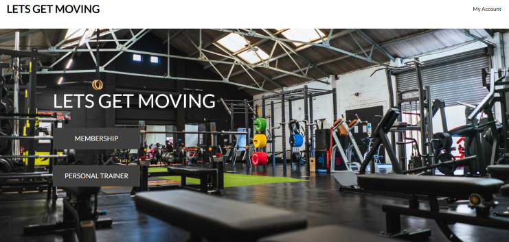

# Lets Get Moving
LGM is a gym for everyone, regardless of experience or physique.
At LGM, everyone is welcome to improve and feel better.

## UX
- As a new user, you will be able to easily navigate around the page with a simple dropdown menu, two quick links on the main page.

- user can register and obtain gym membership through simple and clear directives

- On the user's page you can save personal info, see how much time they have left on the membership

- Users can submit a booking request to one or more of our coaches

## Features

- Main Page
  

- Membership
  

- Coach
  

- Login
  

- Regester
  

- payment
  

## Deployment
  #### Local deployment
   - repo is found here https://github.com/5undel/LGM
   - Click the green button "Gitpod"
   - Lunch the site
   - type in the terminal - pip3 install django - to install django to the project
   - In the terminal - pyton manage.py runserver
   -  click the link the pops up in the right bottom corner 
   -Or click Ctrl + http://127.0.0.1:8000/ in the terminal

  #### Heroku Setup and CLI

This project has been deployed to Heroku.
Steps taken to deploy are as follows:

- Create a **requirements.txt** file using the terminal command `pip3 freeze --local > requirements.txt`
- Create a **Procfile** with the terminal command `echo web: python3 run.py > Procfile`
- install whitenoise - `pip install whitenoise` - whitenoise will store the static file and imgaes for the project.
- `git add` and `git commit` the new **requirements** and **Procfile**, then `git push` the project to GitHub.

- Navigate over to Heroku.com
- Click the "new" button, and give the project a name & set the region to Europe.
- From the Heroku dashboard of your newly created application, click on "Deploy" > "Deployment method" and select GitHub.
- Confirm the linking of the Heroku app to the correct GitHub repository.
- Select "Enable Manual Deployment", and then click the "Deploy" button.

 - The live link can be found here - https://lets-get-moving.herokuapp.com/
 - Click the lgin link at the top left, at the login page click the register link to create a account. 

## Test
- Jigsaw - [Jigsaw page](https://jigsaw.w3.org/css-validator/validator?uri=https%3A%2F%2F8000-5undel-lgm-jmjnwwifs0s.ws-eu38.gitpod.io%2F&profile=css3svg&usermedium=all&warning=1&vextwarning=&lang=sv/)

   
- Lighthouse

  

## WEBBROWSER
- Chrome
    

- Edge
    

- Fierfox
    

## Credit

- Style and layout - [Bootstrap](https://getbootstrap.com/)
- Background image - [Unsplash](https://unsplash.com/s/photos/gym)
- Countdown time - [stackoverflow](https://stackoverflow.com/questions/38276672/todays-date-30-days-in-javascript)

## Future ideas
 - Future ideas are that the user should be able to book current appointments directly with the chosen coach

 - The owner should be able to have an online store

 - 
